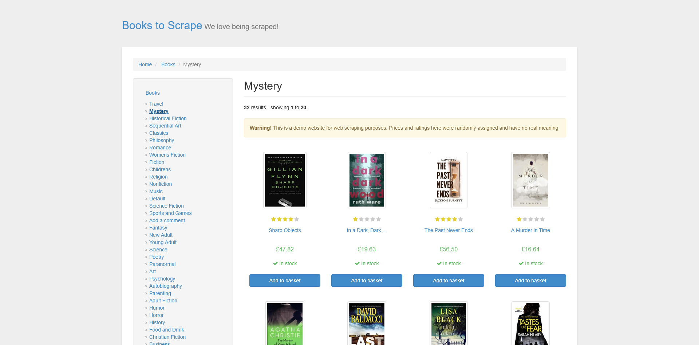
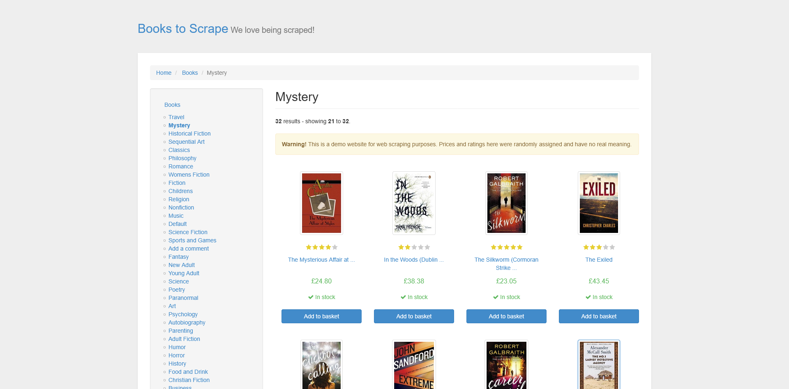

# Extracting a category to CSV

A complete run, reproduced as it happened: an AI assistant with AIHawk's
browser attached over MCP reads a 32-book category spread over two pages and
produces a CSV. The site is `books.toscrape.com`, which exists to be scraped
and says so in its own banner.

This is the setup from [option 1 of the README](../../README.md): the
assistant brings the model, the MCP server brings the browser. The run below
was driven by Claude through that server, tool call by tool call, exactly as
your assistant would drive it. Nothing here is a paraphrase of what the agent
would do; it is what it did, with the one wrong turn left in.

## The prompt

Paste-able as given:

> Go to books.toscrape.com and open the Mystery category. Extract every book
> in the category, all pages, with title, price, availability and star rating,
> into a CSV. Use the full titles, not the truncated ones on the cards. Tell
> me how many you got and check it against the count the page itself reports.

## The run

**1. Open a tab and navigate.** `session_new_page` returns `tab-1`;
`browser_navigate` to `https://books.toscrape.com/` lands on the catalogue
home. A `browser_snapshot` shows the page title, the URL and the visible
links, including one per category in the sidebar.

**2. Click into the category.** Not a typed URL: `browser_click` on
`a[href*="category/books/mystery"]`, the same link a person would click.

**3. First read, and the wrong turn.** `browser_read_text` on the results
section returns twenty books with prices and stock, which looks like the
extraction is nearly done. It is not. The listing truncates titles: the text
says `In a Dark, Dark ...` and `The Murder of Roger ...`, and a CSV built
from the visible text would carry the ellipses into the data. The full title
is in the `title` attribute of each card's link, which text extraction never
sees. This is the step where a run that trusts its first read produces a
plausible, wrong file.

**4. Structured extraction instead.** `browser_evaluate` with an expression
that reads each `article.product_pod`: the `title` attribute for the full
title, `.price_color` for the price, `.availability` trimmed, and the star
rating from the `star-rating` class name, which encodes it as a word (`One`
to `Five`). Twenty complete rows come back, ellipses gone:
`In a Dark, Dark Wood`, `The Murder of Roger Ackroyd (Hercule Poirot #4)`.



**5. Pagination.** The page says `Page 1 of 2`, so `browser_click` on
`li.next a`, then the same `browser_evaluate` on page 2, this time also
returning `location.href` and the pager text as a position check: the URL now
ends in `page-2.html` and the pager reads `Page 2 of 2`. Twelve more rows.



**6. The count check.** The category header declares `32 results`. The two
extractions total 20 + 12 = 32. That line in the prompt is not decoration: a
selector that silently matches nothing produces a short file that looks
finished, and the page's own count is the only witness.

## The result

[`mystery-books.csv`](mystery-books.csv), 32 rows plus a header:

```csv
title,price_gbp,availability,star_rating
Sharp Objects,47.82,In stock,Four
"In a Dark, Dark Wood",19.63,In stock,One
The Past Never Ends,56.50,In stock,Four
A Murder in Time,16.64,In stock,One
The Murder of Roger Ackroyd (Hercule Poirot #4),44.10,In stock,Four
...
```

The screenshots above are the browser's own captures from the run, returned
by `browser_take_screenshot` at steps 4 and 5. The session ran headless, as
MCP sessions do; the browser's screenshots are the visual record.

## Recorded against

| Piece | Version |
|---|---|
| invisible-playwright-mcp | 0.3.0 |
| invisible_playwright | 0.8.3 |
| invisible_core | 26.17.0 |
| Engine | firefox-26 |

Run date: 2026-09-03. The tool names and response shapes above are this
version's; if yours differ, check your versions before assuming the page
changed.

## Reproducing it

Attach the browser to your assistant (from the
[README](../../README.md#1-you-already-use-claude-code-claude-desktop-or-cursor)):

```bash
claude mcp add -s user stealth -- uvx invisible-playwright-mcp
```

Then paste the prompt. The reading companion for this task shape, including
when a plain diff tool beats an agent and what the failure modes look like,
is [extracting data to a CSV with an AI agent](https://github.com/feder-cr/AIHawk/wiki/how-to-extract-data-to-csv-with-an-ai-agent)
on the wiki.
