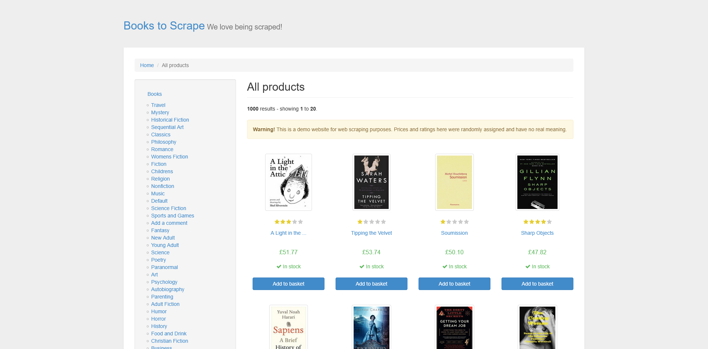

# Web research, audited

An agent's numbers are claims. This is a complete run where the claims got
checked: the agent counted prices across a 60-book catalog, a deterministic
script computed the same answer from the same pages, and the two are printed
side by side. The site is `books.toscrape.com`, the public scraping sandbox.

The article exists because "ground every number in what the pages show" is
easy to write in a prompt and hard to trust in an answer. Here the trust is
replaced with a measurement.

## The prompt

The same instruction the
[web research page](https://github.com/feder-cr/AIHawk/wiki/ai-agent-web-research)
uses as its worked example:

> Go to https://books.toscrape.com/. Walk the first three pages
> of the catalog and report: how many books are priced above forty pounds, and
> the three most common price bands you observe. Ground every number in what
> the pages show; do not estimate.

## The agent's run

Driven by Claude through the MCP server, exactly as option 1 of the
[README](../../README.md) wires it. The transcript, tool call by tool call:

1. `session_new_page` -> `tab-1`; `browser_navigate` to
   `catalogue/page-1.html`.
2. `browser_read_text` on the results section: twenty titles with twenty
   prices, read as visible text. The model counts from what it read.
3. Same two calls for `page-2.html` and `page-3.html`: twenty prices each.
4. No `browser_evaluate`, no DOM tricks: this run deliberately stays on the
   reading path, because the reading path is the one whose arithmetic is
   worth auditing.



The agent's answer, per page and in total:

| page | prices above 40.00 | band tally |
|---|---|---|
| 1 | 10 | 50-60: 8, 20-30: 4, 10-20: 3, 30-40: 3, 40-50: 2 |
| 2 | 5 | 30-40: 7, 10-20: 5, 20-30: 3, 50-60: 3, 40-50: 2 |
| 3 | 9 | 10-20: 6, 50-60: 5, 40-50: 4, 20-30: 3, 30-40: 2 |
| **total** | **24** | **50-60: 16, 10-20: 14, 30-40: 12**, 20-30: 10, 40-50: 8 |

Reported: **24 books above forty pounds**; most common bands **50-60, 10-20,
30-40 pounds**.

## The audit

[`ground_truth.py`](ground_truth.py), on the same engine as a plain library
script - no model anywhere - executed right before the agent's run:

```text
books: 60
above 40: 24
50-60 16
10-20 14
30-40 12
20-30 10
40-50 8
```

**Agent 24, script 24. Same three bands, same tallies, all five bands
identical.** The raw data is in [`prices.csv`](prices.csv) (60 rows,
page/title/price), so the count is re-checkable by anyone with a spreadsheet.

## What this does and does not prove

It proves the pleasant case: on sixty items across three clean pages, with an
explicit "do not estimate" in the prompt and prices that arrive as tidy
`£NN.NN` strings, model counting matched deterministic counting exactly.

It does not prove the general case, and the boundary is worth stating plainly.
Sixty is a number a careful reader holds; six hundred is not. Clean price
strings are the easy input; prices buried in prose, spread across variants, or
rendered as images are where reading starts to drift. The honest conclusions:

- **For pure counting on structured pages, the script IS the tool.** It costs
  no model tokens and cannot miscount. The agent's edge starts where the
  criteria are prose ("which of these look overpriced for what they are"),
  not where the arithmetic is.
- **The audit is cheap insurance when you do use the agent.** The script here
  is twelve lines against the same engine. If a number is about to drive a
  decision, twelve lines is a fair price for knowing rather than trusting.
- **A matching audit on a small sample is how you earn the right to trust a
  bigger one** - and a mismatched audit is how you find out for the cost of a
  sandbox run instead of a wrong decision.

## Recorded against

| Piece | Version |
|---|---|
| invisible-playwright-mcp | 0.3.0 (the locally installed server that drove this run; releases have moved well past it, so your tool names may differ) |
| invisible_playwright | 0.8.3 |
| invisible_core | 26.17.0 |
| Engine | firefox-26 |

Run date: 2026-09-04. Both runs, agent and audit, on the same date against
the same pages.

## Reproducing it

Attach the browser to your assistant
([README, option 1](../../README.md#1-you-already-use-an-assistant-that-can-run-tools)),
paste the prompt, then run `python ground_truth.py` (needs
`pip install invisible-playwright`) and compare. The reading companion for
this task shape is
[AI agents for web research](https://github.com/feder-cr/AIHawk/wiki/ai-agent-web-research)
on the wiki.
