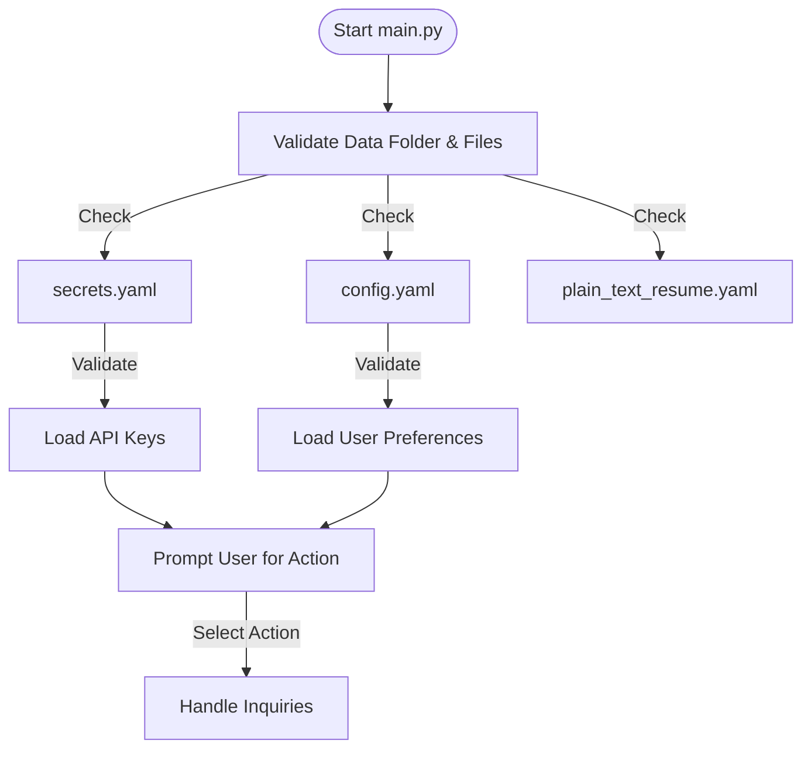
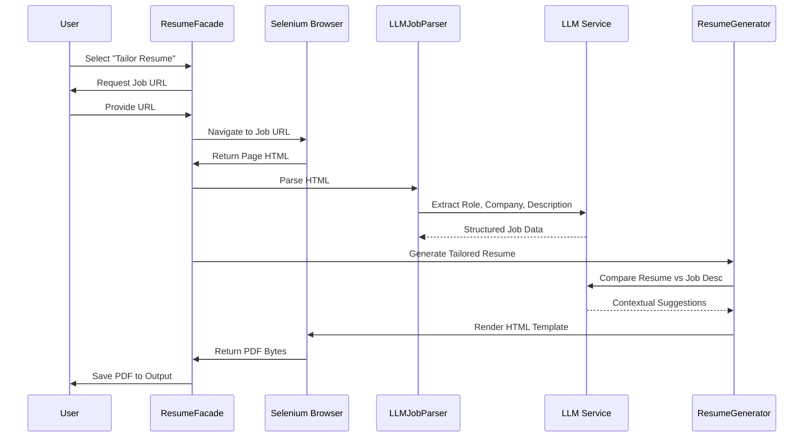
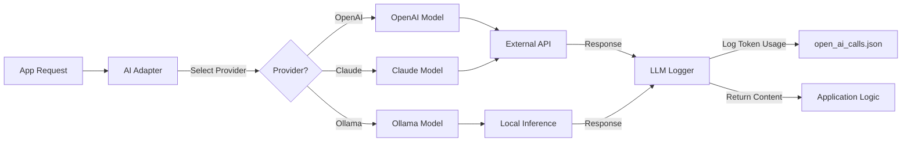

# Application Flows

This document details the key workflows within the AIHawk application using Mermaid diagrams.

## 1. App Startup Flow

The application initialization process ensures all configurations and dependencies are ready before user interaction.



## 2. Resume Parsing & Tailoring Flow

How the system takes a specific job URL and tailored a resume for it.



## 3. General Resume Generation Flow

Generating a generic resume without specific job tailoring.

```mermaid
graph TD
    User[User Input] -->|Select Style| StyleManager[Style Manager]
    StyleManager -->|Template Path| Generator[Resume Generator]
    
    subgraph Generation Process
        ResumeData[Load Resume Data] -->|Inject| Generator
        Generator -->|Render| HTML[HTML Resume]
        HTML -->|Convert| PDF[PDF Generator (Selenium)]
    end
    
    PDF --> Output[Output Folder]
```

## 4. LLM Request Lifecycle

How the system handles requests to the Large Language Model, including logging and error handling.


