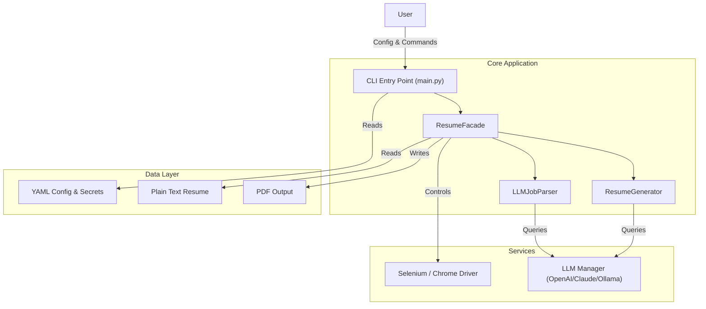

# System Architecture Overview

## Introduction
**Jobs_Applier_AI_Agent_AIHawk** is an automated tool designed to streamline the job application process. It leverages Large Language Models (LLMs) to parse job descriptions, tailor resumes and cover letters, and automate interactions via a web browser.

## High-Level Architecture

The system operates on a modular architecture where the **Core Controller** orchestrates interactions between the **User**, **LLM Service**, **Browser Automation**, and **Data Layer**.

## Core Components

### 1. Entry Point & Configuration (`main.py`)
- **Responsibilities**: 
  - Handles user input via CLI.
  - Validates configuration (`secrets.yaml`, `config.yaml`).
  - Initializes the application environment.
- **Key Classes**: `ConfigValidator`, `FileManager`.

### 2. Logic Orchestration (`src/libs/resume_and_cover_builder/resume_facade.py`)
- **Responsibilities**:
  - Acts as the central hub connecting the UI (CLI) with backend logic.
  - Manages the flow of parsing job descriptions and generating documents.
- **Key Classes**: `ResumeFacade`.

### 3. LLM Integration (`src/libs/llm_manager.py`)
- **Responsibilities**:
  - Abstracts interactions with various AI providers (OpenAI, Claude, Ollama, Gemini, etc.).
  - Manages prompt templates and chains for specific tasks (e.g., summarizing skills, generating cover letters).
- **Key Classes**: `GPTAnswerer`, `AIAdapter`.

### 4. Resume Generation (`src/libs/resume_and_cover_builder/resume_generator.py`)
- **Responsibilities**:
  - Fills HTML templates with tailored content.
  - Converts HTML to PDF.
- **Key Classes**: `ResumeGenerator`.

## Tech Stack

- **Language**: Python 3.10+
- **Browser Automation**: Selenium WebDriver, ChromeDriverManager
- **LLM Orchestration**: LangChain
- **Configuration**: YAML
- **Data Validation**: Pydantic, Dataclasses
